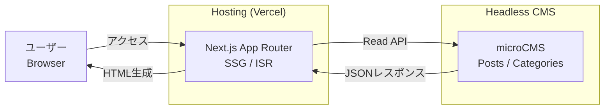
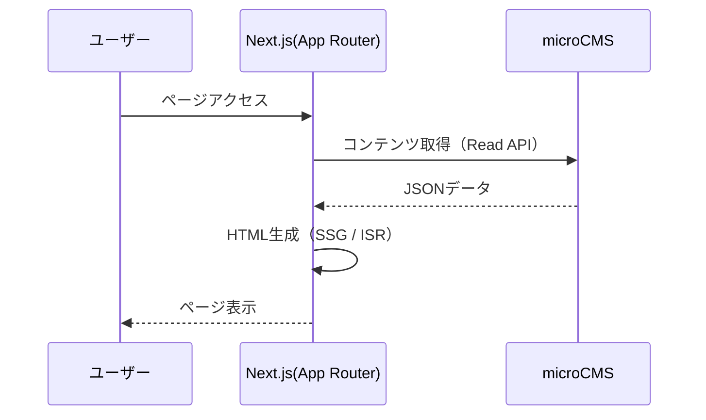

## はじめに

Next.js（App Router）と microCMS を使って、  
**「実務でもそのまま使えるシンプルな Headless CMS 構成」** を実装しました。

本記事では、その実装を題材にしながら、

- App Router 時代の CMS 構成はどう考えるべきか
- microCMS をどう設計すれば運用しやすいか
- SSG / ISR をどう使い分ければいいか

といった点を、**実装ベースで整理・解説**していきます。

---

### この記事で作るもの

- Next.js（App Router）を使った CMS フロントエンド
- microCMS を使った記事管理
- 記事一覧・記事詳細ページ
- SSG / ISR による高速配信構成

完成イメージは、以下のような **最小構成のブログ / メディアサイト** です。

- 個人ブログ
- 技術ブログ
- 小規模なオウンドメディア
- コーポレートサイトの「お知らせ」機能

---

### 対象読者

以下のような方を想定しています。

- Next.js App Router を使い始めたが、設計に迷っている
- microCMS を「とりあえず」使っているが、正解が分からない
- Headless CMS を実務で導入・運用したい
- SSG / ISR の違いをちゃんと理解したい

※ Next.js / React の基本的な知識がある前提です。

---

### サンプルコード

本記事で解説している実装は、以下の GitHub リポジトリで公開しています。

https://github.com/xinome/nextjs-headlesscms-web-sample

コードを見ながら読み進めると、理解しやすくなります。

---

## 全体構成とデータフロー

まずは、今回の構成を **ざっくり把握**しましょう。

### システム構成図



### ポイント
- ユーザーは Next.js にのみアクセス
- microCMS は API 専用（画面を持たない）
- Next.js がデータ取得と画面生成を担当
- 表示は SSG / ISR により高速

---

## データフロー（ページ表示の流れ）




### 補足
- 初回ビルド時、または再検証時のみ microCMS にアクセス
- キャッシュ期間内は API 通信なし
- 更新頻度が低い CMS コンテンツと相性が良い構成

---

## 使用技術と設計方針

### 使用技術
- Next.js（App Router）
- TypeScript
- microCMS
- SSG / ISR
- Vercel（デプロイ想定）

---

### なぜ App Router を使うのか

Next.js 13 以降、App Router が標準となりました。

App Router では、
- Server Component がデフォルト
- データ取得と描画を密接に扱える
- SSG / ISR を自然に書ける

といったメリットがあります。

特に CMS との相性が非常に良い のがポイントです。

---

### なぜ microCMS を使うのか

microCMS は、
- 日本語ドキュメントが充実している
- 管理画面がシンプル
- API が分かりやすい
- 小規模〜中規模サイトに向いている

といった特徴があります。

「Headless CMS を初めて触る」という方にも扱いやすいサービスです。

---

### 今回やらないこと

本記事では、以下の内容は扱いません。
- 認証・ログイン機能
- 管理画面のカスタマイズ
- プレビュー機能
- 高度な SEO チューニング

まずは 「迷わず運用できる最小構成」 に集中します。

---

## microCMS 側のセットアップ

### サービス作成

microCMS にログインし、新しいサービスを作成します。

---

### コンテンツモデル設計

今回は以下の 2 つを用意します。

**posts（記事）**
- title（テキスト）
- content（リッチエディタ）
- category（参照）
- publishedAt（公開日時）

**categories（カテゴリ）**
- name（テキスト）
- slug（テキスト）

※ slug は URL に使用します。

---

### API 設定
- Read API キーを発行
- 公開状態のコンテンツのみ取得する設定

👉 Next.js 側からは Read API のみ使用します。

---

## Next.js プロジェクト作成と構成

### プロジェクト作成

```bash
npx create-next-app@latest
```

- App Router を選択
- TypeScript を有効化


---

### ディレクトリ構成

```
src/
├─ app/
│  ├─ layout.tsx
│  ├─ page.tsx              // 記事一覧
│  └─ posts/
│     └─ [slug]/
│        └─ page.tsx        // 記事詳細
│
├─ libs/
│  └─ microcms.ts           // microCMS クライアント
│
├─ types/
│  └─ microcms.ts           // 型定義
```

この構成をベースに、実装を進めていきます。

---

## microCMS クライアントの実装

まずは、Next.js 側から microCMS にアクセスするためのクライアントを実装します。

### microCMS SDK の導入

```bash
npm install microcms-js-sdk
```


---

### クライアント定義

libs/microcms.ts を作成します。

```typescript
import { createClient } from "microcms-js-sdk";

if (!process.env.MICROCMS_SERVICE_DOMAIN) {
  throw new Error("MICROCMS_SERVICE_DOMAIN is required");
}

if (!process.env.MICROCMS_API_KEY) {
  throw new Error("MICROCMS_API_KEY is required");
}

export const client = createClient({
  serviceDomain: process.env.MICROCMS_SERVICE_DOMAIN,
  apiKey: process.env.MICROCMS_API_KEY,
});
```

### ポイント
- 環境変数チェックは必ず行う
- ビルド時にエラーを出せるため、設定漏れに気づきやすい
- App Router では Server Component がデフォルトなので、この実装で問題なし

---

### 型定義

types/microcms.ts を用意します。

```typescript
import type { MicroCMSDate, MicroCMSImage } from "microcms-js-sdk";

export type Category = {
  name: string;
  slug: string;
};

export type Post = {
  title: string;
  content: string;
  category: Category;
} & MicroCMSDate;
```

👉 **microCMS の型は「最低限＋必要になったら追加」**が扱いやすいです。

---

## 記事一覧ページの実装（SSG / ISR）

トップページでは、記事一覧を表示します。

### データ取得処理

app/page.tsx に実装します。

```typescript
import { client } from "@/libs/microcms";
import type { Post } from "@/types/microcms";

export const revalidate = 60;

export default async function Home() {
  const data = await client.getList<Post>({
    endpoint: "posts",
  });

  return (
    <main>
      <h1>記事一覧</h1>
      <ul>
        {data.contents.map((post) => (
          <li key={post.id}>
            <a href={`/posts/${post.id}`}>{post.title}</a>
          </li>
        ))}
      </ul>
    </main>
  );
}
```

---

### SSG / ISR の考え方
- revalidate = 60
  → 60秒ごとに再生成される ISR
- 初回ビルド時は 完全に静的生成
- キャッシュ期間内は microCMS にアクセスしない

実務での目安
| 更新頻度 | revalidate |
| ---- | ---- |
| ほぼ更新しない | 数時間〜1日 |
| たまに更新 | 数分〜数十分 |
| 頻繁に更新 | 60秒以下 |


---

## 記事詳細ページの実装

次に、記事詳細ページを作成します。

### ディレクトリ構成

```
app/posts/[slug]/page.tsx
```

---

### 静的パス生成

```typescript
import { client } from "@/libs/microcms";
import type { Post } from "@/types/microcms";

export async function generateStaticParams() {
  const data = await client.getList<Post>({
    endpoint: "posts",
  });

  return data.contents.map((post) => ({
    slug: post.id,
  }));
}
```

---

### 記事詳細取得と表示

```typescript
export const revalidate = 60;

export default async function PostPage({
  params,
}: {
  params: { slug: string };
}) {
  const post = await client.get<Post>({
    endpoint: "posts",
    contentId: params.slug,
  });

  return (
    <article>
      <h1>{post.title}</h1>
      <div dangerouslySetInnerHTML={{ __html: post.content }} />
    </article>
  );
}
```

注意点
- dangerouslySetInnerHTML は microCMS のリッチエディタ前提
- 外部入力を扱う場合はサニタイズを検討

---

## カテゴリ設計と拡張

カテゴリを使う場合は、以下のような設計が一般的です。

### URL 設計例
- /categories/[slug]
- /posts/[slug]

---

### カテゴリ別記事取得（例）

```typescript
await client.getList<Post>({
  endpoint: "posts",
  queries: {
    filters: `category.slug[equals]${slug}`,
  },
});
```

ポイント
- URL 設計と CMS 設計は 必ずセットで考える
- 後から変更すると SEO 影響が大きい

---

## App Router でハマりやすいポイント

### Server / Client Component の違い
- useState / useEffect を使う → Client Component
- データ取得だけ → Server Component

👉 CMS 連携部分は Server Component に寄せるとシンプル。

---

### build 時エラーの原因
- 環境変数未設定
- generateStaticParams の戻り値不正
- 型の不整合

👉 まずはビルドログを見る

---

### 実務での使いどころ

この構成は、以下の用途にそのまま使えます。
- 技術ブログ
- コーポレートサイト
- お知らせ / ニュースページ
- 小規模オウンドメディア

---

### 次の拡張アイデア
- プレビュー機能
- Draft 対応
- ページネーション
- SEO（Metadata API）
- 管理画面連携

---

## まとめ

Next.js（App Router）と microCMS を組み合わせることで、
- 高速
- シンプル
- 運用しやすい

Headless CMS 構成を作ることができます。

まずは 最小構成で動かす → 必要に応じて拡張
このスタンスがおすすめです。


## 参考サイト

- [Next.js](https://nextjs.org/)
- [microCMS](https://microcms.io/)

